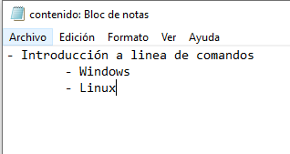
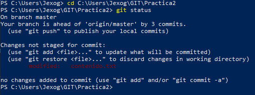
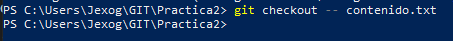
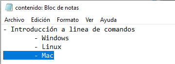
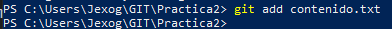
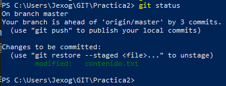
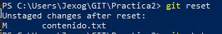
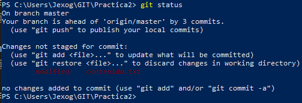
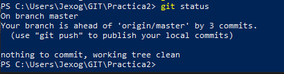

#    Practica 4 GIT
##  Deshacer cambios

######   Jorge Jankovich Ramos - 2020

1. Entra en el directorio de la práctica2 (practica2git) y a partir de ahí realizaremos esta práctica. Debes tener en cuenta que la práctica 3 debe estar realizada para hacer esta. 
https://github.com/JorgeJR96/Ejercicio3

2. Elimina la linea - Mac del fichero contenido.txt. 

3.Comprueba el estado del repositorio. 

4. Deshaz los cambios realizados en el fichero contenido.txt y vuelve a la versión anterior del fichero. 

5. Comprobar el estado del repositorio y el contenido del fichero modificado. 

6. Eliminar la última línea del fichero contenido.txt y guardarlo. 

7. Añadir los cambios a la zona de preparado. 

8. Comprobar de nuevo el estado del repositorio. 

9. Quitar los cambios de la zona de intercambio temporal, pero mantenerlos en el directorio de trabajo. 

10. Comprobar de nuevo el estado del repositorio. 

11. Deshacer los cambios realizados en el fichero contenido.txt para volver a la versión anterior del fichero. 

12. Volver a comprobar el estado del repositorio. FIN 
